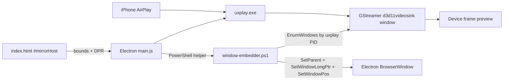
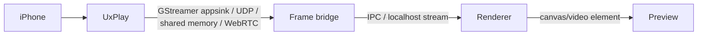

# In-app Preview Architecture — iPhone Mirror

## Goal

The Electron app owns the user experience: the iPhone/iPad preview frame in `index.html` is the primary mirror surface. UxPlay/GStreamer may still create a native video window internally, but users should see it embedded/aligned inside the Electron device frame, not as the final separate UI.

## Current chosen path

### Phase 1 — Windows native-window embed fallback (implemented/current)

Why this path first:

- It preserves the working UxPlay receiver.
- It avoids a multi-day rewrite of AirPlay/video transport.
- It matches anh's requested UX immediately: mirror belongs inside the app preview.
- If `SetParent` fails on a specific GPU/GStreamer backend, the same helper can still snap/resize the mirror window to the preview bounds as a degraded fallback.

### Phase 2 — true headless stream (future upgrade)

Target path when time allows:

Candidate approaches:

1. Patch/launch UxPlay with a GStreamer pipeline ending in `appsink` or `tcpserversink`.
2. Use a local MJPEG/WebSocket bridge from GStreamer frames into Electron.
3. If UxPlay exposes only a sink window on Windows, keep SetParent until a lower-level capture path is stable.

## Runtime responsibilities

### `main.js`

- Resolve `uxplay.exe` from `process.resourcesPath` when packaged, or `../uxplay-src/build/uxplay.exe` in dev.
- Spawn UxPlay with:
  - `-nh` to avoid help/no history behavior.
  - `-m <primary MAC>` when available.
  - `-vs d3d11videosink` for Windows GPU sink.
  - no `-fs`, because fullscreen creates a top-level mirror surface outside the app.
- Poll every ~1200ms after start to find/embed the mirror window.
- Re-run embed on resize/move and on `mirror-host-resized` IPC.
- Send status to renderer:
  - `uxplay-status`: server state/IP/name.
  - `uxplay-log`: stdout/stderr.
  - `mirror-embed-status`: waiting/embedded state.

### `preload.js`

Expose safe bridge:

- `mirror.start(options)`
- `mirror.stop()`
- `mirror.getIP()`
- `mirror.mirrorHostResized(bounds)`
- `mirror.onStatus(callback)`
- `mirror.onLog(callback)`
- `mirror.onEmbedStatus(callback)`

### `index.html`

- Render device frame (`iPhone` / `iPad`).
- Keep real host div `#mirrorHost` inside `.device-screen`.
- Notify main process when bounds change using `ResizeObserver` and frame toggles.
- Hide placeholder content only when embed status says `embedded: true`.

### `window-embedder.ps1`

- Enumerate visible top-level windows belonging to the UxPlay process.
- Ignore console windows.
- Prefer titles/classes matching iPhone/Mirror/AirPlay/UxPlay/GStreamer/Direct3D.
- Call `SetParent(child, electronWindowHwnd)`.
- Convert the child to `WS_CHILD | WS_VISIBLE` and remove caption/popup styles.
- Resize to exact `#mirrorHost` bounds in physical pixels.

## Success indicators

- While waiting: UI says `Đang chờ cửa sổ mirror của iPhone...`.
- On connect: placeholder fades, status pill says `Đã gắn màn hình iPhone vào trong app`.
- Moving/resizing Electron or switching iPhone/iPad frame keeps the mirror aligned.

## Known limitations

- Needs real iPhone AirPlay to confirm GStreamer window class/title behavior on anh's machine.
- Some Direct3D/GStreamer windows may resist stable reparenting. If so, fallback is to snap/topmost-align window to preview area or move to a frame-stream bridge.
- Audio is off by default for mirror stability in course recording.
